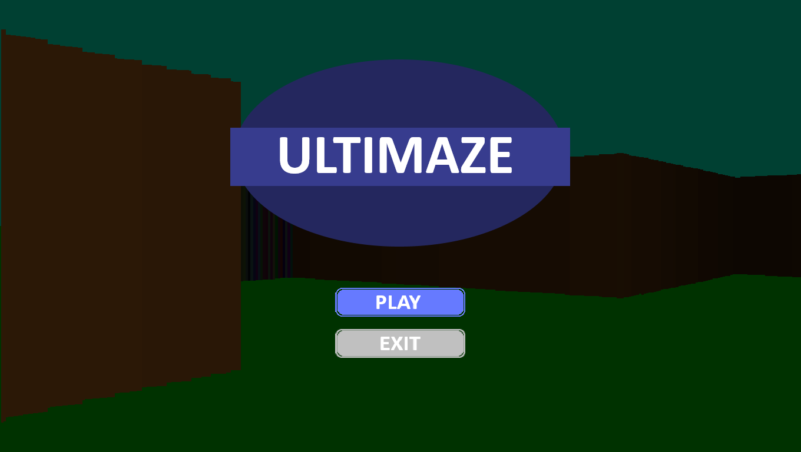
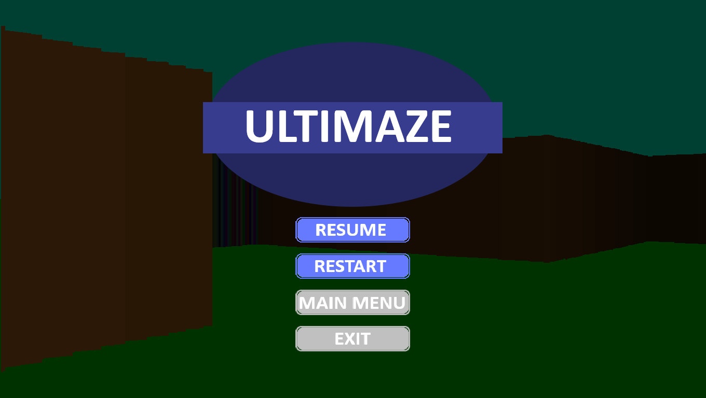
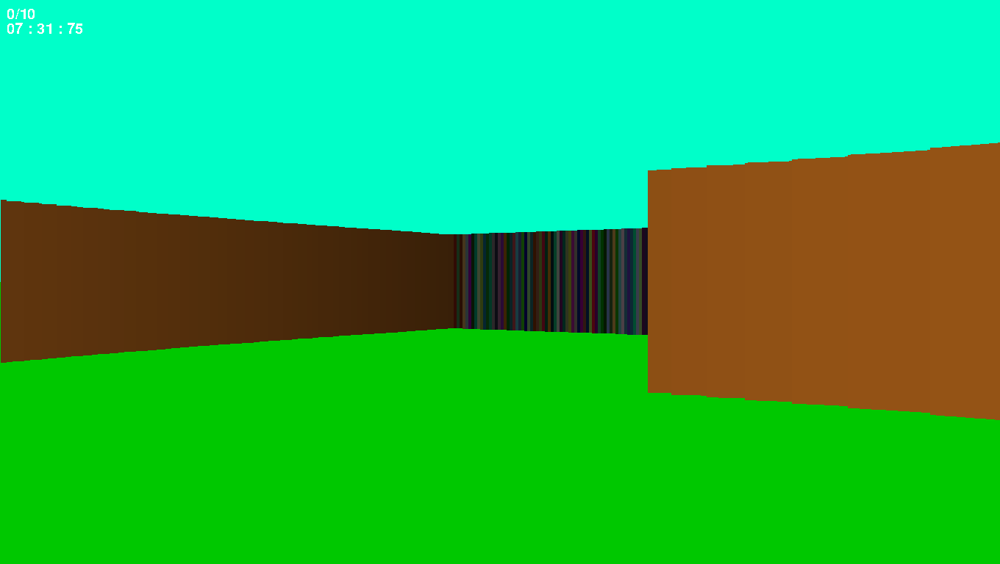

# Ultimaze

Ultimaze est un jeu en 2.5D, réalisé dans le cadre d'un projet de NSI. 

La consigne était d'utiliser la librairie pygame pour créer un jeu en mettant à profit des classes.

## Sommaire:
* installation
* utilistation
* le labyrinth
* le raycasting

## 1. Installation

```
pip install ultimaze
python main.py
```
Ou utlisé l'installer dans /dist/ultimaze.exe
Puis exécutez l'installer

## 2. Utilisation


Quand vous êtes prêt, appuyez sur "Play" pour commencer le jeu.

Devez collecter toutes les murs multicolorts **en marchant dessus** avant de trouver la sortie (attention elle est discrète).

Utilisez les flèches directionnelles ou ZQSD pour vous déplacer.

Vous pouvez aussi mettre pause en appuyant sur "Echap".



Le chrono sera temporairement stoppé.

Votre but est de trouver la sortie en moins de temps possible.

## 3. Le labyrinthe

Le labyrinth est un labyrinthe en 2.5D.
Il est généré aléatoirement et se regénère à chaque début de partie; il fait une taille de 10x10.
Il possède un taux d'erreur de génration (le labyrinth ne peut pas être fini) de moins de 1%.

## 4. Le raycasting

Le raycasting est un algorithme de rendu de 2.5D.
Il est utilisé pour dessiner le labyrinthe.
Il fonctionne en projetant des rayons contre les murs et en récupérant la longueur des rayons on sait quelle hauteur de pixel afficher.



## Merci

Merci a tous ceux qui essayeront le jeu, qui font des retours ou proposent des améliorations.

Si vous souhaiertiez aider, vous pouvez me contacter sur github ou par mail tristan.tr.renard@gmail.com.
Vous pouvez aussi me soutenir en faisant un don sur mon [paypal](https://www.paypal.com/paypalme/labarbedeMerlin):
[https://www.paypal.com/paypalme/labarbedeMerlin](https://www.paypal.com/paypalme/labarbedeMerlin)